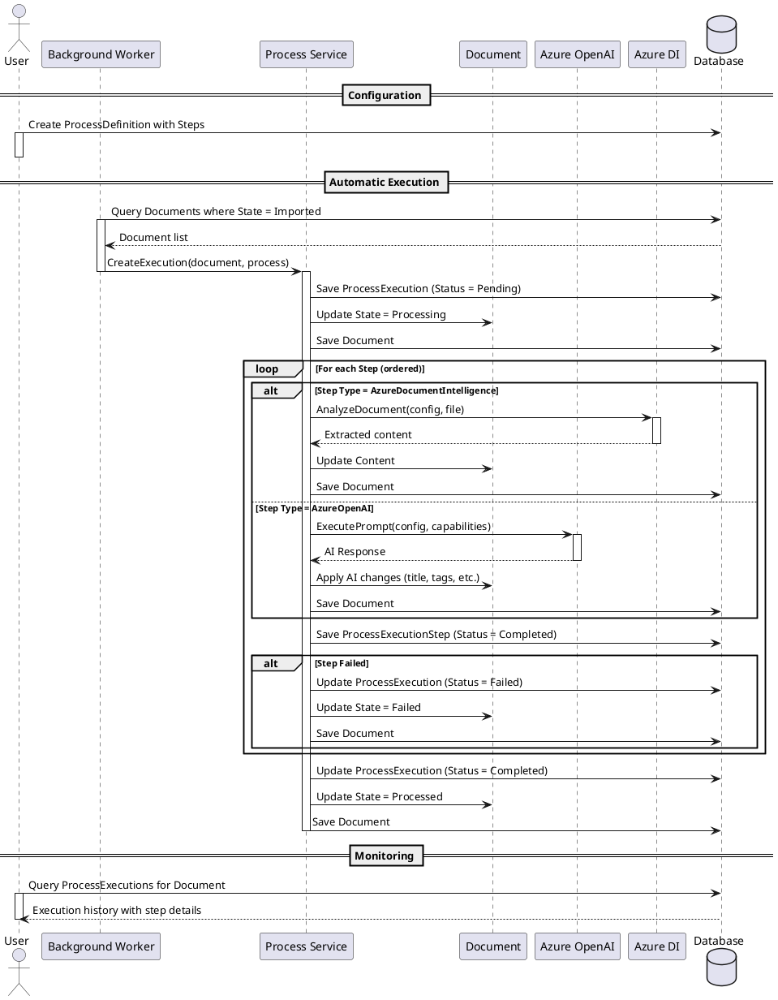
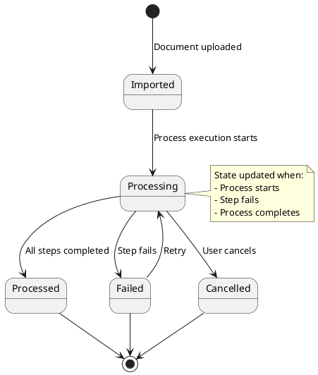

# Document Processing System

## Overview

The document processing system provides automated workflows for processing documents through configurable multi-step pipelines. It supports Azure OpenAI and Azure Document Intelligence integrations to extract content, classify documents, and enrich metadata.

## Components

### Domain Model

#### ProcessDefinition

Represents a user-configured process template that defines the workflow for processing documents.

- **Name**: User-friendly process name
- **Description**: Purpose and behavior description
- **Enabled**: Whether the process is active
- **TriggerState**: Document state that triggers this process (e.g., `Imported`)
- **Steps**: Ordered collection of `ProcessingStep` objects

#### ProcessingStep

Defines a single step within a process. Two types are supported:

1. **Azure OpenAI Step** (`StepType.AzureOpenAI`)
   - **Prompt**: Instructions for the AI model
   - **Endpoint**: Azure OpenAI service URL
   - **ApiKey**: Authentication key
   - **DeploymentName**: Model deployment identifier
   - **Capabilities**: AI can perform document operations:
     - Set/Get document title, content, tags
     - Set/Get correspondent, contract, document type
     - Query documents and related entities

2. **Azure Document Intelligence Step** (`StepType.AzureDocumentIntelligence`)
   - **Endpoint**: Azure Document Intelligence service URL
   - **ApiKey**: Authentication key
   - **ModelId**: Document Intelligence model name
   - **OutputType**: Expected output format (e.g., `Markdown`, `Text`)
   - Sets the document content from extracted text

**Common Properties:**
- **Name**: Step identifier
- **Description**: Step purpose
- **Order**: Execution sequence (ascending)

#### ProcessExecution

Represents a runtime instance of a process executing against a specific document.

- **Id**: Unique execution identifier
- **ProcessDefinitionId**: Reference to the process template
- **DocumentId**: Target document
- **Status**: Current execution state
  - `Pending`: Queued for execution
  - `Running`: Currently executing
  - `Completed`: Successfully finished all steps
  - `Failed`: One or more steps failed
  - `Cancelled`: Manually stopped
- **StartedAt**: Execution start timestamp
- **CompletedAt**: Execution end timestamp
- **Steps**: Collection of `ProcessExecutionStep` results

#### ProcessExecutionStep

Records the result of executing a single step.

- **StepName**: Reference to the step definition
- **Order**: Step sequence number
- **Status**: Step outcome (`Pending`, `Running`, `Completed`, `Failed`, `Skipped`)
- **StartedAt**: Step start timestamp
- **CompletedAt**: Step end timestamp
- **ErrorMessage**: Failure details (if applicable)
- **Output**: Step result data (e.g., extracted content, AI response)

### Architecture Diagram

```plantuml
@startuml
!include https://raw.githubusercontent.com/plantuml-stdlib/C4-PlantUML/master/C4_Component.puml

LAYOUT_WITH_LEGEND()

Container_Boundary(domain, "Domain Layer") {
    Component(processDef, "ProcessDefinition", "Aggregate", "Defines processing workflow with steps")
    Component(processExec, "ProcessExecution", "Aggregate", "Tracks execution instance and results")
    Component(document, "Document", "Aggregate", "Document with state")
    Component(processService, "IProcessExecutionService", "Port", "Executes process steps")
}

Container_Boundary(infra, "Infrastructure Layer") {
    Component(processRepo, "ProcessDefinitionRepository", "Repository", "Persists process definitions")
    Component(execRepo, "ProcessExecutionRepository", "Repository", "Persists execution history")
    Component(azureOpenAI, "AzureOpenAIService", "Adapter", "Integrates with Azure OpenAI")
    Component(azureDI, "AzureDocumentIntelligenceService", "Adapter", "Integrates with Azure DI")
    Component(backgroundWorker, "ProcessExecutionWorker", "Hosted Service", "Periodically checks for pending documents")
}

Container_Boundary(api, "API Layer") {
    Component(processController, "ProcessDefinitionsController", "Controller", "CRUD operations for processes")
    Component(execController, "ProcessExecutionsController", "Controller", "Query execution history")
}

Rel(processController, processDef, "Manages")
Rel(execController, processExec, "Queries")
Rel(backgroundWorker, document, "Finds documents in Imported state")
Rel(backgroundWorker, processService, "Creates executions")
Rel(processService, azureOpenAI, "Executes AI steps")
Rel(processService, azureDI, "Executes DI steps")
Rel(processService, execRepo, "Persists results")
Rel(processService, document, "Updates state")

@enduml
```

## Processing Flow



## Document State Transitions



## Azure OpenAI Capabilities

When a step uses Azure OpenAI, the AI model can be configured with capabilities to interact with the document system:

- **Document Operations**:
  - `SetDocumentTitle`: Update document title
  - `SetDocumentContent`: Update document content
  - `SetDocumentTags`: Assign tags to document
  - `GetDocument`: Retrieve document details
  - `GetDocuments`: Query multiple documents
  - `GetDocumentContent`: Read document text

- **Entity Operations**:
  - `SetDocumentCorrespondent`: Assign correspondent
  - `SetDocumentContract`: Assign contract
  - `SetDocumentType`: Assign document type
  - `GetCorrespondents`: List available correspondents
  - `GetContracts`: List available contracts
  - `GetDocumentTypes`: List available document types

These capabilities are exposed as function/tool calls to the AI model using the OpenAI function calling API.

## Background Processing

The `ProcessExecutionWorker` is a background hosted service that:

1. Runs on a configurable schedule (e.g., every 30 seconds)
2. Queries for documents matching `ProcessDefinition.TriggerState` (e.g., `Imported`)
3. Finds active `ProcessDefinition` entries where `Enabled = true`
4. Creates `ProcessExecution` for each eligible document
5. Executes steps sequentially via `IProcessExecutionService`
6. Updates document state throughout the process
7. Logs all step results to `ProcessExecutionStep`

The worker uses background processing to avoid blocking the main application and ensures reliable execution even if steps take significant time.

## Configuration

Process definitions are user-configurable through the API and UI:

- Create/Update/Delete process definitions
- Add/Remove/Reorder steps
- Configure Azure service credentials (stored securely)
- Enable/Disable processes
- View execution history and step results

## Error Handling

- **Step Failure**: If a step fails, the execution is marked as `Failed`, the document state is set to `Failed`, and subsequent steps are skipped
- **Retry**: Failed executions can be retried (manual or automatic)
- **Logging**: All errors are captured in `ProcessExecutionStep.ErrorMessage`
- **Rollback**: Document state changes are transactional

## Security Considerations

- Azure API keys are stored encrypted
- Process execution runs with system privileges
- AI capabilities are scoped to the target document's context
- Audit trail maintained via execution history
