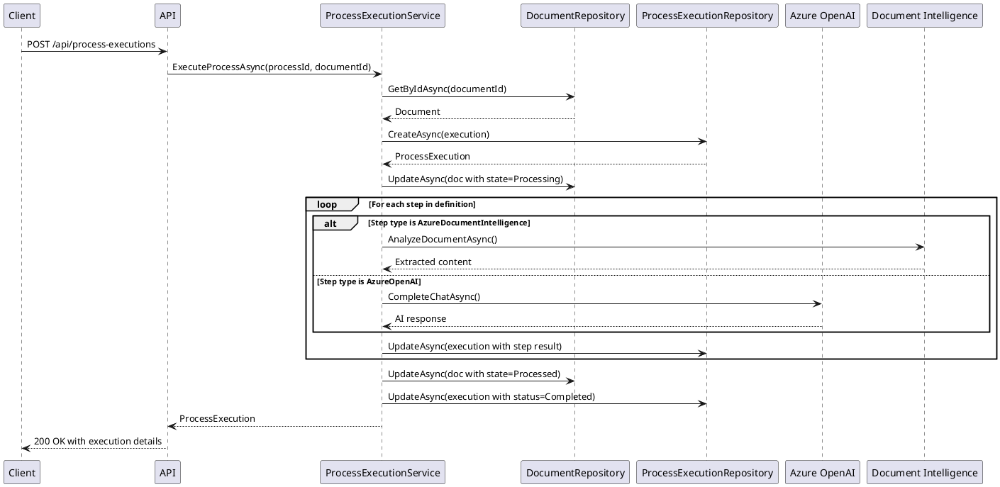
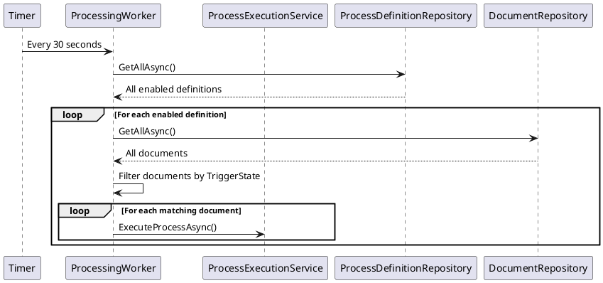

# Document Processing System

## Overview

The document processing system enables automated workflows to be executed on documents as they progress through different lifecycle states. It uses Azure Cognitive Services to extract content and enrich metadata.

## Components

```plantuml
@startuml
!include https://raw.githubusercontent.com/plantuml-stdlib/C4-PlantUML/master/C4_Component.puml

Container_Boundary(domain, "Central.Domain") {
    Component(processService, "ProcessExecutionService", "Domain Service", "Orchestrates process execution")
    Component(processDefinition, "ProcessDefinition", "Aggregate Root", "Defines processing steps")
    Component(processExecution, "ProcessExecution", "Entity", "Tracks execution state")
    Component(processingStep, "ProcessingStep", "Entity", "Individual step configuration")
}

Container_Boundary(infra, "Central.Infrastructure") {
    Component(processRepo, "ProcessDefinitionRepository", "Repository", "Persists process definitions")
    Component(executionRepo, "ProcessExecutionRepository", "Repository", "Persists execution history")
}

Container_Boundary(server, "Central.Server") {
    Component(processEndpoints, "ProcessDefinitionEndpoints", "FastEndpoints", "REST API for definitions")
    Component(executionEndpoints, "ProcessExecutionEndpoints", "FastEndpoints", "REST API for executions")
    Component(backgroundWorker, "ProcessingWorker", "BackgroundService", "Triggers processes automatically")
}

Container_Boundary(azure, "Azure Services") {
    Component(openai, "Azure OpenAI", "External Service", "Text analysis and enrichment")
    Component(docIntel, "Document Intelligence", "External Service", "Document content extraction")
}

Rel(processEndpoints, processService, "Uses")
Rel(executionEndpoints, processService, "Uses")
Rel(backgroundWorker, processService, "Triggers")
Rel(processService, processRepo, "Uses")
Rel(processService, executionRepo, "Uses")
Rel(processService, openai, "Calls")
Rel(processService, docIntel, "Calls")
Rel(processService, processDefinition, "Creates/Manages")
Rel(processDefinition, processingStep, "Contains")
Rel(processExecution, processDefinition, "References")

@enduml
```

## Domain Model

### ProcessDefinition (Aggregate Root)

Defines a reusable workflow that can be triggered when documents reach a specific state.

**Properties:**
- `Id` - Unique identifier
- `Name` - Human-readable name
- `Description` - Purpose of the process
- `Enabled` - Whether the process should run automatically
- `TriggerState` - Document state that triggers execution (e.g., `Imported`)
- `Steps` - Ordered collection of processing steps
- `Created` / `Updated` - Audit timestamps

**Invariants:**
- Name must be unique
- Steps must have sequential order (0, 1, 2, ...)
- At least one step is required
- Trigger state must be a valid DocumentState

### ProcessingStep (Entity)

Represents a single action in a processing workflow.

**Properties:**
- `Id` - Unique identifier
- `ProcessDefinitionId` - Parent process
- `Name` - Step description
- `StepType` - Type of action to perform
- `Order` - Execution sequence (0-based)
- `Configuration` - JSON configuration specific to step type

**Step Types:**
- `AzureOpenAI` - Calls Azure OpenAI for text analysis
- `AzureDocumentIntelligence` - Extracts content using Document Intelligence
- `Custom` - (Future) User-defined logic

### ProcessExecution (Entity)

Tracks a single execution of a process definition on a document.

**Properties:**
- `Id` - Unique identifier
- `ProcessDefinitionId` - Process being executed
- `DocumentId` - Document being processed
- `Status` - Current execution state
- `StartedAt` - When execution began
- `CompletedAt` - When execution finished
- `ErrorMessage` - Error details if failed
- `Steps` - Collection of step executions

**Status Values:**
- `Pending` - Not yet started
- `Running` - Currently executing
- `Completed` - All steps successful
- `Failed` - One or more steps failed
- `Cancelled` - Manually stopped

### ProcessExecutionStep (Entity)

Tracks execution of a single step within a process execution.

**Properties:**
- `Id` - Unique identifier
- `ProcessExecutionId` - Parent execution
- `StepName` - Name from ProcessingStep
- `StepType` - Type from ProcessingStep
- `Order` - Execution sequence
- `Status` - Step execution state
- `StartedAt` / `CompletedAt` - Timing
- `ErrorMessage` - Error details
- `Output` - Result data from step execution

## Process Execution Flow



## Background Processing

A `BackgroundService` runs continuously to automatically trigger processes:



**Implementation:**
- Runs every 30 seconds
- Fetches all enabled process definitions
- For each definition, finds documents matching `TriggerState`
- Checks if document has already been processed
- Triggers execution if not

## Azure Integration

### Azure OpenAI Step

**Purpose:** Analyze document content using large language models to extract structured information, summarize text, or enrich metadata.

**Configuration:**
```json
{
  "Endpoint": "https://<resource>.openai.azure.com",
  "ApiKey": "<api-key>",
  "DeploymentName": "gpt-4",
  "Prompt": "Analyze this document: {documentContent}",
  "SystemPrompt": "You are a helpful AI assistant."
}
```

**Execution:**
1. Retrieve document content (from previous step or storage)
2. Create `AzureOpenAIClient` with endpoint and API key
3. Build chat messages with system and user prompts
4. Call `CompleteChatAsync()` to get AI response
5. Store response in step output

**Error Handling:**
- Missing configuration → `InvalidOperationException`
- Invalid credentials → Azure SDK exception
- Rate limiting → Exponential backoff (future)

### Azure Document Intelligence Step

**Purpose:** Extract text, tables, key-value pairs, and structure from documents (PDFs, images).

**Configuration:**
```json
{
  "Endpoint": "https://<resource>.cognitiveservices.azure.com",
  "ApiKey": "<api-key>"
}
```

**Execution:**
1. Get document file path or URL
2. Create `DocumentAnalysisClient` with endpoint and API key
3. Call `AnalyzeDocumentAsync()` with `prebuilt-layout` model
4. Extract content from result:
   - Text content
   - Tables (as markdown)
   - Key-value pairs
5. Store extracted content in step output

**Supported Formats:**
- PDF
- Images (JPEG, PNG, BMP, TIFF)
- Office documents (future)

## API Endpoints

### Process Definitions

- `GET /api/process-definitions` - List all definitions
- `GET /api/process-definitions/{id}` - Get specific definition
- `POST /api/process-definitions` - Create new definition
- `PUT /api/process-definitions/{id}` - Update definition
- `DELETE /api/process-definitions/{id}` - Delete definition

### Process Executions

- `GET /api/process-executions` - List all executions
- `GET /api/process-executions/{id}` - Get specific execution with steps
- `POST /api/process-executions` - Trigger manual execution
- `GET /api/documents/{documentId}/executions` - Get executions for document

## Database Schema

```sql
-- Process Definitions
CREATE TABLE ProcessDefinitions (
    Id BIGSERIAL PRIMARY KEY,
    Name VARCHAR(200) NOT NULL UNIQUE,
    Description TEXT,
    Enabled BOOLEAN NOT NULL DEFAULT true,
    TriggerState VARCHAR(50) NOT NULL,
    Created TIMESTAMPTZ NOT NULL,
    Updated TIMESTAMPTZ NOT NULL
);

-- Processing Steps
CREATE TABLE ProcessingSteps (
    Id BIGSERIAL PRIMARY KEY,
    ProcessDefinitionId BIGINT NOT NULL REFERENCES ProcessDefinitions(Id) ON DELETE CASCADE,
    Name VARCHAR(200) NOT NULL,
    StepType VARCHAR(50) NOT NULL,
    "Order" INT NOT NULL,
    Configuration TEXT,
    UNIQUE(ProcessDefinitionId, "Order")
);

-- Process Executions
CREATE TABLE ProcessExecutions (
    Id BIGSERIAL PRIMARY KEY,
    ProcessDefinitionId BIGINT NOT NULL REFERENCES ProcessDefinitions(Id),
    DocumentId BIGINT NOT NULL REFERENCES Documents(Id),
    Status VARCHAR(50) NOT NULL,
    StartedAt TIMESTAMPTZ NOT NULL,
    CompletedAt TIMESTAMPTZ,
    ErrorMessage TEXT
);

-- Process Execution Steps
CREATE TABLE ProcessExecutionSteps (
    Id BIGSERIAL PRIMARY KEY,
    ProcessExecutionId BIGINT NOT NULL REFERENCES ProcessExecutions(Id) ON DELETE CASCADE,
    StepName VARCHAR(200) NOT NULL,
    StepType VARCHAR(50) NOT NULL,
    "Order" INT NOT NULL,
    Status VARCHAR(50) NOT NULL,
    StartedAt TIMESTAMPTZ,
    CompletedAt TIMESTAMPTZ,
    ErrorMessage TEXT,
    Output TEXT
);

-- Indexes
CREATE INDEX IX_ProcessExecutions_DocumentId ON ProcessExecutions(DocumentId);
CREATE INDEX IX_ProcessExecutions_Status ON ProcessExecutions(Status);
CREATE INDEX IX_ProcessExecutionSteps_ExecutionId ON ProcessExecutionSteps(ProcessExecutionId);
```

## Security Considerations

1. **API Key Storage**
   - Never commit API keys to source control
   - Use Azure Key Vault for production
   - Consider Managed Identity for Azure-hosted apps

2. **Input Validation**
   - Validate all step configurations before execution
   - Sanitize user prompts to prevent injection
   - Limit document size for processing

3. **Rate Limiting**
   - Respect Azure service quotas
   - Implement retry logic with exponential backoff
   - Monitor API usage and costs

4. **Access Control**
   - Only authenticated users can create processes
   - Consider role-based access for sensitive operations
   - Audit log all process executions

## Performance Considerations

1. **Async Processing**
   - All Azure calls use async/await
   - Document processing doesn't block API responses
   - Background worker processes documents in parallel (future)

2. **Caching**
   - Cache process definitions in memory (future)
   - Store extracted content to avoid re-processing
   - Consider CDN for static document access

3. **Scalability**
   - Background worker can run on multiple instances
   - Use distributed locks to prevent duplicate processing (future)
   - Consider message queue for high-volume scenarios

## Future Enhancements

1. **Custom Step Types**
   - Allow users to register custom processing logic
   - Support webhook callbacks
   - Enable script execution (sandboxed)

2. **Advanced Orchestration**
   - Conditional branching based on step outputs
   - Parallel step execution
   - Sub-processes and reusable workflows

3. **Monitoring**
   - Real-time execution progress updates (SignalR)
   - Cost tracking per execution
   - Performance metrics and alerting

4. **Retry Logic**
   - Automatic retry on transient failures
   - Configurable retry policies per step
   - Dead letter queue for failed executions
