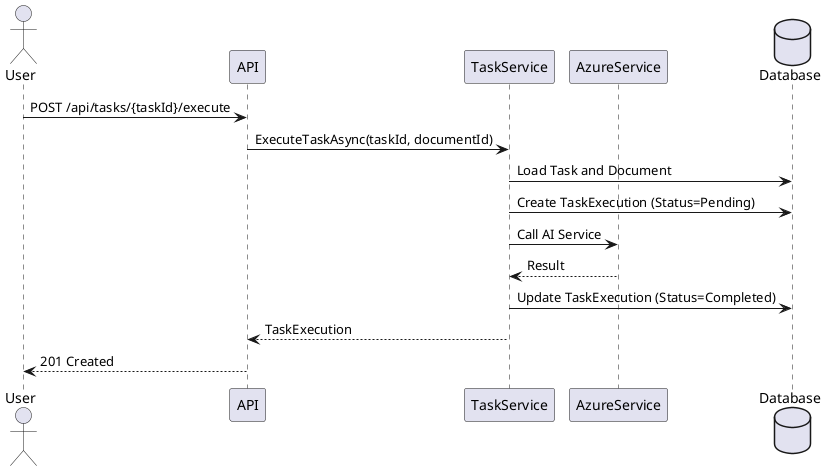
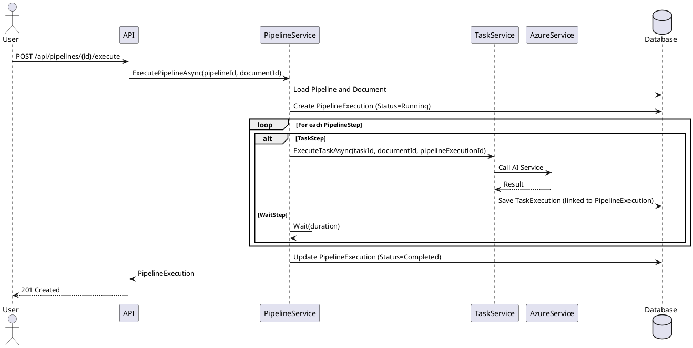

# Tasks and Pipelines

## Overview

The document processing system is built on two core concepts:

1. **Tasks** - Reusable units of work that perform specific AI operations (e.g., AzureDocumentIntelligence, AzureOpenAI)
2. **Pipelines** - Orchestrated workflows that execute a series of steps, which can be task steps or wait steps

This design promotes reusability, testability, and flexibility. Tasks can be executed independently on documents or composed into complex pipelines.

## Architecture Diagram

```plantuml
@startuml
!include https://raw.githubusercontent.com/plantuml-stdlib/C4-PlantUML/master/C4_Component.puml

Container_Boundary(domain, "Central.Domain") {
    Component(task, "Task", "Aggregate Root", "Reusable AI processing unit")
    Component(taskConfig, "TaskConfiguration", "Value Object", "Task-specific config (endpoint, model, prompt)")
    Component(pipeline, "Pipeline", "Aggregate Root", "Orchestrated workflow")
    Component(pipelineStep, "PipelineStep", "Entity", "Step in pipeline (Task or Wait)")
    Component(taskExecution, "TaskExecution", "Entity", "Tracks task execution")
    Component(pipelineExecution, "PipelineExecution", "Entity", "Tracks pipeline execution")
    Component(taskService, "TaskExecutionService", "Domain Service", "Executes tasks")
    Component(pipelineService, "PipelineExecutionService", "Domain Service", "Orchestrates pipelines")
}

Container_Boundary(azure, "Azure Services") {
    Component(openai, "Azure OpenAI", "External Service", "Text analysis and enrichment")
    Component(docIntel, "Document Intelligence", "External Service", "Document content extraction")
}

Rel(pipeline, pipelineStep, "Contains")
Rel(pipelineStep, task, "References (TaskStep)")
Rel(task, taskConfig, "Has")
Rel(taskExecution, task, "References")
Rel(pipelineExecution, pipeline, "References")
Rel(pipelineExecution, taskExecution, "Contains")
Rel(taskService, task, "Executes")
Rel(pipelineService, taskService, "Uses")
Rel(taskService, openai, "Calls")
Rel(taskService, docIntel, "Calls")

@enduml
```

## Domain Model

### Task (Aggregate Root)

Represents a reusable AI processing task that can be executed independently or as part of a pipeline.

**Properties:**
- `Id` - Unique identifier
- `Name` - Human-readable name
- `Description` - Purpose of the task
- `TaskType` - Type of AI operation (AzureOpenAI, AzureDocumentIntelligence)
- `Configuration` - TaskConfiguration value object
- `Enabled` - Whether the task can be executed
- `Created` / `Updated` - Audit timestamps

**Invariants:**
- Name must be unique
- Configuration must be valid for the task type
- Disabled tasks cannot be executed

**Examples:**
- "Extract Invoice Data" - Document Intelligence task for structured data extraction
- "Classify Document Type" - OpenAI task for document classification
- "Summarize Content" - OpenAI task for content summarization

### TaskConfiguration (Value Object)

Type-specific configuration for a task.

**Properties:**
- `AzureEndpoint` - Azure service endpoint URL
- `AzureApiKey` - API authentication key
- `AzureModelOrDeployment` - Model ID or deployment name
- `Prompt` - AI prompt (for OpenAI tasks)
- `Temperature` - Sampling temperature (for OpenAI tasks)
- `MaxTokens` - Maximum response tokens (for OpenAI tasks)
- `Capabilities` - Enabled capabilities JSON (for OpenAI tasks)
- `DocumentIntelligenceOptions` - DI-specific options JSON

**Validation:**
- OpenAI tasks require: Endpoint, ApiKey, Deployment, Prompt
- Document Intelligence tasks require: Endpoint, ApiKey, Model

### Pipeline (Aggregate Root)

Defines an orchestrated workflow that executes multiple steps in sequence.

**Properties:**
- `Id` - Unique identifier
- `Name` - Human-readable name
- `Description` - Purpose of the pipeline
- `Enabled` - Whether the pipeline should run automatically
- `TriggerState` - Document state that triggers execution
- `Steps` - Ordered collection of pipeline steps
- `Created` / `Updated` - Audit timestamps

**Invariants:**
- Name must be unique
- Steps must have sequential order (0, 1, 2, ...)
- At least one step is required
- All referenced tasks must exist and be enabled

### PipelineStep (Entity)

Represents a single step in a pipeline workflow.

**Properties:**
- `Id` - Unique identifier
- `PipelineId` - Parent pipeline
- `StepType` - Type of step (TaskStep, WaitStep)
- `Order` - Execution sequence (0-based)
- `TaskId` - Reference to task (for TaskStep)
- `WaitDuration` - Wait duration in seconds (for WaitStep)
- `Name` - Step description

**Step Types:**
- `TaskStep` - Executes a task on the document
- `WaitStep` - Pauses execution for a specified duration

### TaskExecution (Entity)

Tracks the execution of a task on a document.

**Properties:**
- `Id` - Unique identifier
- `TaskId` - Task being executed
- `DocumentId` - Document being processed
- `PipelineExecutionId` - Optional parent pipeline execution
- `Status` - Current execution state (Pending, Running, Completed, Failed)
- `StartedAt` - When execution began
- `CompletedAt` - When execution finished
- `ErrorMessage` - Error details if failed
- `Result` - JSON result from AI service

**Key Features:**
- Task executions from pipelines are linked via `PipelineExecutionId`
- Direct task executions have `PipelineExecutionId = null`
- All executions appear in unified execution history

### PipelineExecution (Entity)

Tracks the execution of a pipeline on a document.

**Properties:**
- `Id` - Unique identifier
- `PipelineId` - Pipeline being executed
- `DocumentId` - Document being processed
- `Status` - Overall execution status
- `StartedAt` - When execution began
- `CompletedAt` - When execution finished
- `ErrorMessage` - Error details if failed
- `TaskExecutions` - Collection of task executions from pipeline steps

## Execution Flow

### Direct Task Execution



### Pipeline Execution



## Benefits

### Reusability
- Tasks can be reused across multiple pipelines
- Common operations (e.g., "Extract text", "Classify") are defined once
- Changes to task configuration automatically apply to all pipelines

### Testability
- Tasks can be tested independently without pipelines
- Task execution logic is isolated and mockable
- Pipeline orchestration can be tested separately

### Flexibility
- Users can execute tasks directly for ad-hoc processing
- Pipelines can mix task steps with wait steps
- Easy to add new task types or step types

### Visibility
- All task executions are tracked in a unified history
- Direct and pipeline-triggered executions are visible together
- Clear lineage from pipeline execution to task executions

## Use Cases

### 1. Create Reusable Task
```
User creates "Extract Invoice Data" task:
- TaskType: AzureDocumentIntelligence
- Model: prebuilt-invoice
- Endpoint and ApiKey configured

This task can now be:
- Executed directly on any document
- Added to multiple pipelines
```

### 2. Execute Task Directly
```
User uploads an invoice document
User selects "Extract Invoice Data" task
System creates TaskExecution and processes document
Result shows extracted fields (vendor, total, date)
```

### 3. Create Pipeline with Wait Step
```
User creates "Staged Document Processing" pipeline:
Step 0: TaskStep → "Extract Text" task
Step 1: WaitStep → 60 seconds (allow human review)
Step 2: TaskStep → "Classify Document" task
Step 3: TaskStep → "Extract Metadata" task
```

### 4. View Execution History
```
User views executions for a document:
- PipelineExecution: "Staged Processing" (3 task executions)
  - TaskExecution: "Extract Text" (Completed)
  - TaskExecution: "Classify Document" (Completed)
  - TaskExecution: "Extract Metadata" (Completed)
- TaskExecution: "Extract Invoice Data" (direct execution)
```

## Migration Strategy

The existing `ProcessDefinition` and `ProcessingStep` models will be migrated to the new Task and Pipeline models:

1. **ProcessDefinition** → **Pipeline**
   - Rename table and entities
   - Add `TriggerState` (already exists)
   
2. **ProcessingStep** → Split into:
   - **Task** (new table) - One task per unique StepType+Configuration combination
   - **PipelineStep** (new table) - References Task or defines WaitStep

3. **ProcessExecution** → **PipelineExecution**
   - Rename table and entities
   
4. **ProcessExecutionStep** → **TaskExecution**
   - Rename table
   - Add `TaskId` reference
   - Add `PipelineExecutionId` (nullable)

## API Design

### Task Endpoints

- `POST /api/tasks` - Create task
- `GET /api/tasks` - List all tasks
- `GET /api/tasks/{id}` - Get task by ID
- `PUT /api/tasks/{id}` - Update task
- `DELETE /api/tasks/{id}` - Delete task
- `POST /api/tasks/{id}/execute` - Execute task on document
- `GET /api/tasks/{id}/executions` - Get execution history for task

### Pipeline Endpoints

- `POST /api/pipelines` - Create pipeline
- `GET /api/pipelines` - List all pipelines
- `GET /api/pipelines/{id}` - Get pipeline by ID
- `PUT /api/pipelines/{id}` - Update pipeline
- `DELETE /api/pipelines/{id}` - Delete pipeline
- `POST /api/pipelines/{id}/execute` - Execute pipeline on document
- `GET /api/pipelines/{id}/executions` - Get execution history for pipeline

### Execution Endpoints

- `GET /api/executions` - List all executions (tasks + pipelines)
- `GET /api/executions/tasks/{id}` - Get task execution details
- `GET /api/executions/pipelines/{id}` - Get pipeline execution details
- `GET /api/documents/{id}/executions` - Get all executions for document
