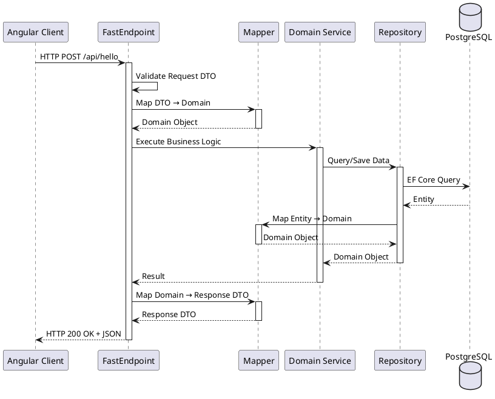
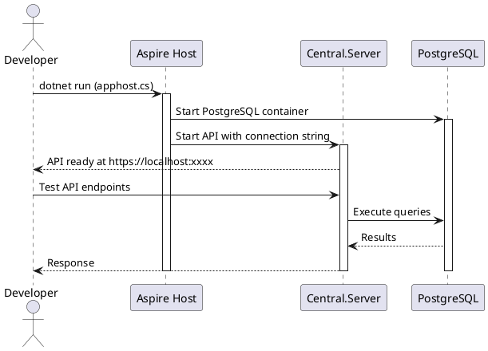

# Runtime View

## Typical Request Flow

This diagram shows how a typical API request flows through the hexagonal architecture layers.

## Request Processing Steps

1. **Client Request**: Angular client sends HTTP request with JSON payload
2. **Validation**: FastEndpoints validates request DTO using FluentValidation
3. **DTO → Domain Mapping**: Riok.Mapperly mapper converts DTO to domain object
4. **Business Logic**: Domain service executes core business rules
5. **Data Access**: Repository retrieves/persists data via EF Core
6. **Entity ↔ Domain Mapping**: Mapper converts between database entities and domain objects
7. **Domain → DTO Mapping**: Mapper converts domain result to response DTO
8. **Response**: FastEndpoints sends HTTP response with JSON payload

## Local Development Flow

